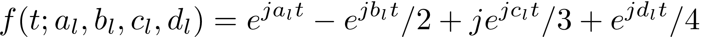

This page contains additional information and data for the paper

L. Angioloni, T. Borghuis, L. Brusci, and P. Frasconi. CONLON: A Pseudo-Song Generator Based on a New Pianoroll, Wasserstein Autoencoders, and Optimal Interpolations. *In  Proceedings of the 21st International Society for Music Information Retrieval Conference*, ISMIR 2020.


CONLON is a pattern-based MIDI music generator with three main features:
- A novel pianoroll-like description of patterns
- Wasserstein eutoencoders as the underlying generative model
- Optimal trajectories for interpolation and swirls.

CONLON was developed as a collaborative effort between the [AI Lab](http://ai.dinfo.unifi.it) at [DINFO](http://dinfo.unifi.it), [University of Florence](https://www.unifi.it), (Italy) and [MUSI-CO](https://www.musi-co.com/), a music generation startup based in Eindhoven (the Netherlands).

Table of Contents
-----------------

* [Datasets](#datasets)
  * [Architecture details](#architecture-details)
  * [Features](#features)
  * [Swirls](#swirls)
  * [Supplementary files](#supplementary-files)
  * [Surveys](#surveys)
  * [Source code](#source-code)
  * [Acknowledments](#acknowledment)

## Datasets
The paper comes with two novel datasets especially composed by professional musicians for this research. Datasets are made available here **exclusively for academic research purposes** and cannot be used in any commercial project. Please cite the above paper if you use these datasets in your research work.

- **ASF-4** This is a dataset in genres *Acid Jazz*, *Soul*, and *Funk*. It consists of 910 patterns of four 4/4 bars each, with four instruments: Drums, Bass, Rhodes piano, Hammond organ. [Download MIDI files](./ASF-4.tgz)

- **HP-10** This is a dataset in genres *High Pop* and *Progressive Trance*. It consists of 983 patterns of four 4/4 bars each, with ten instruments: drums, bass,
Rhodes, brass-synth, choir, dark-pad, guitar, lead, pad, and strings. [Download MIDI files](./HP-10.tgz)


## Architecture details

We provide here a Keras `model.summary()` for the architectures used in the paper.

### Encoder/decoder for the ASF-4 dataset
```
Model: "encoder"
_________________________________________________________________
Layer (type)                 Output Shape              Param #
=================================================================
input_1 (InputLayer)         [(None, 128, 56, 8)]      0
_________________________________________________________________
conv2d (Conv2D)              (None, 64, 28, 32)        16416
_________________________________________________________________
batch_normalization (BatchNo (None, 64, 28, 32)        128
_________________________________________________________________
activation (Activation)      (None, 64, 28, 32)        0
_________________________________________________________________
conv2d_1 (Conv2D)            (None, 32, 14, 64)        131136
_________________________________________________________________
batch_normalization_1 (Batch (None, 32, 14, 64)        256
_________________________________________________________________
activation_1 (Activation)    (None, 32, 14, 64)        0
_________________________________________________________________
conv2d_2 (Conv2D)            (None, 16, 7, 128)        524416
_________________________________________________________________
batch_normalization_2 (Batch (None, 16, 7, 128)        512
_________________________________________________________________
activation_2 (Activation)    (None, 16, 7, 128)        0
_________________________________________________________________
conv2d_3 (Conv2D)            (None, 8, 4, 256)         2097408
_________________________________________________________________
batch_normalization_3 (Batch (None, 8, 4, 256)         1024
_________________________________________________________________
activation_3 (Activation)    (None, 8, 4, 256)         0
_________________________________________________________________
flatten (Flatten)            (None, 8192)              0
_________________________________________________________________
dense (Dense)                (None, 3)                 24579
=================================================================
Total params: 2,795,875
Trainable params: 2,794,915
Non-trainable params: 960
_________________________________________________________________

Model: "decoder"
_________________________________________________________________
Layer (type)                 Output Shape              Param #
=================================================================
input_2 (InputLayer)         [(None, 3)]               0
_________________________________________________________________
dense_1 (Dense)              (None, 28672)             114688
_________________________________________________________________
reshape (Reshape)            (None, 16, 7, 256)        0
_________________________________________________________________
activation_4 (Activation)    (None, 16, 7, 256)        0
_________________________________________________________________
conv2d_transpose (Conv2DTran (None, 32, 14, 128)       2097280
_________________________________________________________________
batch_normalization_4 (Batch (None, 32, 14, 128)       512
_________________________________________________________________
activation_5 (Activation)    (None, 32, 14, 128)       0
_________________________________________________________________
conv2d_transpose_1 (Conv2DTr (None, 64, 28, 64)        524352
_________________________________________________________________
batch_normalization_5 (Batch (None, 64, 28, 64)        256
_________________________________________________________________
activation_6 (Activation)    (None, 64, 28, 64)        0
_________________________________________________________________
conv2d_transpose_2 (Conv2DTr (None, 128, 56, 32)       131104
_________________________________________________________________
batch_normalization_6 (Batch (None, 128, 56, 32)       128
_________________________________________________________________
activation_7 (Activation)    (None, 128, 56, 32)       0
_________________________________________________________________
conv2d_transpose_3 (Conv2DTr (None, 128, 56, 8)        16392
_________________________________________________________________
activation_8 (Activation)    (None, 128, 56, 8)        0
=================================================================
Total params: 2,884,712
Trainable params: 2,884,264
Non-trainable params: 448
_________________________________________________________________

Model: "autoencoder"
_________________________________________________________________
Layer (type)                 Output Shape              Param #
=================================================================
input_1 (InputLayer)         [(None, 128, 56, 8)]      0
_________________________________________________________________
encoder (Model)              (None, 3)                 2795875
_________________________________________________________________
decoder (Model)              (None, 128, 56, 8)        2884712
=================================================================
Total params: 5,680,587
Trainable params: 5,679,179
Non-trainable params: 1,408
```

### Encoder/decoder for the HP-10 dataset
```
Model: "encoder"
_________________________________________________________________
Layer (type)                 Output Shape              Param #
=================================================================
input_1 (InputLayer)         [(None, 128, 64, 20)]     0
_________________________________________________________________
conv2d (Conv2D)              (None, 64, 32, 32)        40992
_________________________________________________________________
batch_normalization (BatchNo (None, 64, 32, 32)        128
_________________________________________________________________
activation (Activation)      (None, 64, 32, 32)        0
_________________________________________________________________
conv2d_1 (Conv2D)            (None, 32, 16, 64)        131136
_________________________________________________________________
batch_normalization_1 (Batch (None, 32, 16, 64)        256
_________________________________________________________________
activation_1 (Activation)    (None, 32, 16, 64)        0
_________________________________________________________________
conv2d_2 (Conv2D)            (None, 16, 8, 128)        524416
_________________________________________________________________
batch_normalization_2 (Batch (None, 16, 8, 128)        512
_________________________________________________________________
activation_2 (Activation)    (None, 16, 8, 128)        0
_________________________________________________________________
conv2d_3 (Conv2D)            (None, 8, 4, 256)         2097408
_________________________________________________________________
batch_normalization_3 (Batch (None, 8, 4, 256)         1024
_________________________________________________________________
activation_3 (Activation)    (None, 8, 4, 256)         0
_________________________________________________________________
flatten (Flatten)            (None, 8192)              0
_________________________________________________________________
dense (Dense)                (None, 5)                 40965
=================================================================
Total params: 2,836,837
Trainable params: 2,835,877
Non-trainable params: 960
_________________________________________________________________

Model: "decoder"
_________________________________________________________________
Layer (type)                 Output Shape              Param #
=================================================================
input_2 (InputLayer)         [(None, 5)]               0
_________________________________________________________________
dense_1 (Dense)              (None, 131072)            786432
_________________________________________________________________
reshape (Reshape)            (None, 32, 16, 256)       0
_________________________________________________________________
activation_4 (Activation)    (None, 32, 16, 256)       0
_________________________________________________________________
conv2d_transpose (Conv2DTran (None, 64, 32, 128)       2097280
_________________________________________________________________
batch_normalization_4 (Batch (None, 64, 32, 128)       512
_________________________________________________________________
activation_5 (Activation)    (None, 64, 32, 128)       0
_________________________________________________________________
conv2d_transpose_1 (Conv2DTr (None, 128, 64, 64)       524352
_________________________________________________________________
batch_normalization_5 (Batch (None, 128, 64, 64)       256
_________________________________________________________________
activation_6 (Activation)    (None, 128, 64, 64)       0
_________________________________________________________________
conv2d_transpose_2 (Conv2DTr (None, 128, 64, 20)       81940
_________________________________________________________________
activation_7 (Activation)    (None, 128, 64, 20)       0
=================================================================
Total params: 3,490,772
Trainable params: 3,490,388
Non-trainable params: 384
_________________________________________________________________

Model: "autoencoder"
_________________________________________________________________
Layer (type)                 Output Shape              Param #
=================================================================
input_1 (InputLayer)         [(None, 128, 64, 20)]     0
_________________________________________________________________
encoder (Model)              (None, 5)                 2836837
_________________________________________________________________
decoder (Model)              (None, 128, 64, 20)       3490772
=================================================================
Total params: 6,327,609
Trainable params: 6,326,265
Non-trainable params: 1,344
```

### Encoder/decoder for the LPD-5 dataset

```
Model: "encoder"
_________________________________________________________________
Layer (type)                 Output Shape              Param #
=================================================================
input_3 (InputLayer)         [(None, 192, 112, 10)]    0
_________________________________________________________________
conv2d_4 (Conv2D)            (None, 96, 56, 32)        20512
_________________________________________________________________
batch_normalization_6 (Batch (None, 96, 56, 32)        128
_________________________________________________________________
activation_8 (Activation)    (None, 96, 56, 32)        0
_________________________________________________________________
conv2d_5 (Conv2D)            (None, 48, 28, 64)        131136
_________________________________________________________________
batch_normalization_7 (Batch (None, 48, 28, 64)        256
_________________________________________________________________
activation_9 (Activation)    (None, 48, 28, 64)        0
_________________________________________________________________
conv2d_6 (Conv2D)            (None, 24, 14, 128)       524416
_________________________________________________________________
batch_normalization_8 (Batch (None, 24, 14, 128)       512
_________________________________________________________________
activation_10 (Activation)   (None, 24, 14, 128)       0
_________________________________________________________________
conv2d_7 (Conv2D)            (None, 12, 7, 256)        2097408
_________________________________________________________________
batch_normalization_9 (Batch (None, 12, 7, 256)        1024
_________________________________________________________________
activation_11 (Activation)   (None, 12, 7, 256)        0
_________________________________________________________________
flatten_1 (Flatten)          (None, 21504)             0
_________________________________________________________________
dense_2 (Dense)              (None, 5)                 107525
=================================================================
Total params: 2,882,917
Trainable params: 2,881,957
Non-trainable params: 960
_________________________________________________________________

Model: "decoder"
_________________________________________________________________
Layer (type)                 Output Shape              Param #
=================================================================
input_4 (InputLayer)         [(None, 5)]               0
_________________________________________________________________
dense_3 (Dense)              (None, 344064)            2064384
_________________________________________________________________
reshape_1 (Reshape)          (None, 48, 28, 256)       0
_________________________________________________________________
activation_12 (Activation)   (None, 48, 28, 256)       0
_________________________________________________________________
conv2d_transpose_3 (Conv2DTr (None, 96, 56, 128)       2097280
_________________________________________________________________
batch_normalization_10 (Batc (None, 96, 56, 128)       512
_________________________________________________________________
activation_13 (Activation)   (None, 96, 56, 128)       0
_________________________________________________________________
conv2d_transpose_4 (Conv2DTr (None, 192, 112, 64)      524352
_________________________________________________________________
batch_normalization_11 (Batc (None, 192, 112, 64)      256
_________________________________________________________________
activation_14 (Activation)   (None, 192, 112, 64)      0
_________________________________________________________________
conv2d_transpose_5 (Conv2DTr (None, 192, 112, 10)      40970
_________________________________________________________________
activation_15 (Activation)   (None, 192, 112, 10)      0
=================================================================
Total params: 4,727,754
Trainable params: 4,727,370
Non-trainable params: 384
_________________________________________________________________

Model: "autoencoder"
_________________________________________________________________
Layer (type)                 Output Shape              Param #
=================================================================
input_3 (InputLayer)         [(None, 192, 112, 10)]    0
_________________________________________________________________
encoder (Model)              (None, 5)                 2882917
_________________________________________________________________
decoder (Model)              (None, 192, 112, 10)      4727754
=================================================================
Total params: 7,610,671
Trainable params: 7,609,327
Non-trainable params: 1,344
```


## Swirls
Swirls are constructed by creating trajectories in the latent space according to the following complex equation:


Here is an example:


## Supplementary files
These audio files were included as supplementary files in our original submission to ISMIR 2020.
- [Four samples for dataset ASF-4](Samples/Supplementary_1_ASF_4)
- [Three samples for dataset HP-10](Samples/Supplementary_2_HP_10)
- [Three samples for dataset LPD-5](Samples/Supplementary_3_LPD_5)

## Surveys
To validate the CONLON approach, we conducted three listening experiments with a group of 69 musicians. Here we provide the listening material and the raw survey data.

### CONLON vs. MuseGAN
- [CONLON mp3 files](./CONLON_vs_MuseGAN/CONLON/)
- [MuseGAN mp3 files](./CONLON_vs_MuseGAN/MuseGAN/)
- [Spreasheet](./CONLON_vs_MuseGAN/survey.xls)

### Pianorolls vs. CONLON pianorolls
- [Traditional pianorolls: mp3 files](./Pianorolls/Traditional/)
- [CONLON pianorolls: mp3 files](./Pianorolls/CONLON)
- [Spreasheet](./Pianorolls/survey.xls)

### Development over time
- [Swirls](./Development/Swirls/)
- [Spreasheet](./Development/survey.xls)


## Source code
We are sorry that source code cannot be provided at this time. The [WAE implementation of Ilya Tolstikhin](https://github.com/tolstikhin/wae) is a good starting point for developing the generative model.

## Acknowledments
We would like to thank Fabio Schoen for useful discussions. We are grateful to Volker Böhm (Musik Akademie Basel/Fachhochschule Nordwestschweiz),  Luigi Ceccarelli (Conservatorio di Latina), Marek Choloniewski (SME studio, Music Academy of Krakow, University of Krakow), Josef Gruendler (FH Joanneum, Graz), Michał Janocha (SMEAMuz, Poznań), Marco Ligabue (Academia di Belle Arti di Firenze), Adam Stanović (University of Sheffield), and Alla Zagaykevych (National Music Academy of Ukraine) for they valuable help in recruiting musicians who were involved in the listening surveys.
