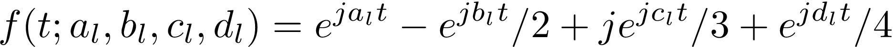
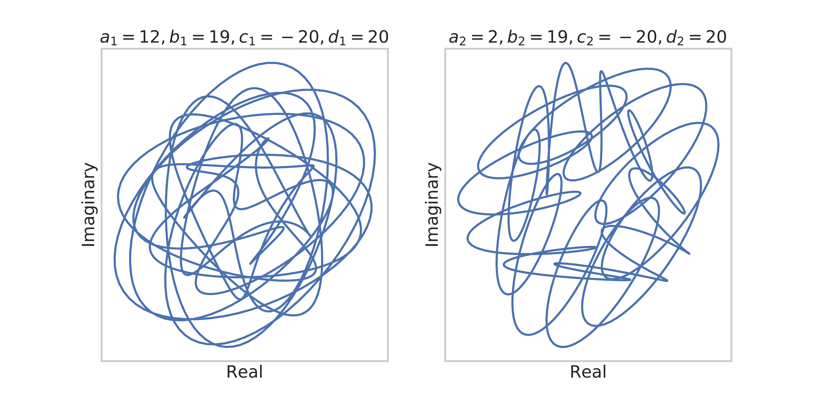

These audio files were included as supplementary files in our original submission to ISMIR 2020. 

- [Four samples for dataset ASF-4](Samples/Supplementary_1_ASF_4)
- [Three samples for dataset HP-10](Samples/Supplementary_2_HP_10)
- [Three samples for dataset LPD-5](Samples/Supplementary_3_LPD_5)

Interpolations are obtained from two test set patterns (start and goal). 
Swirls are obtained by creating trajectories in the latent space according to the following complex equation:

Here is an example:

